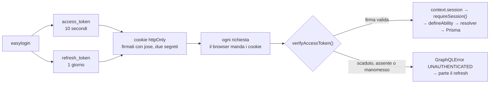
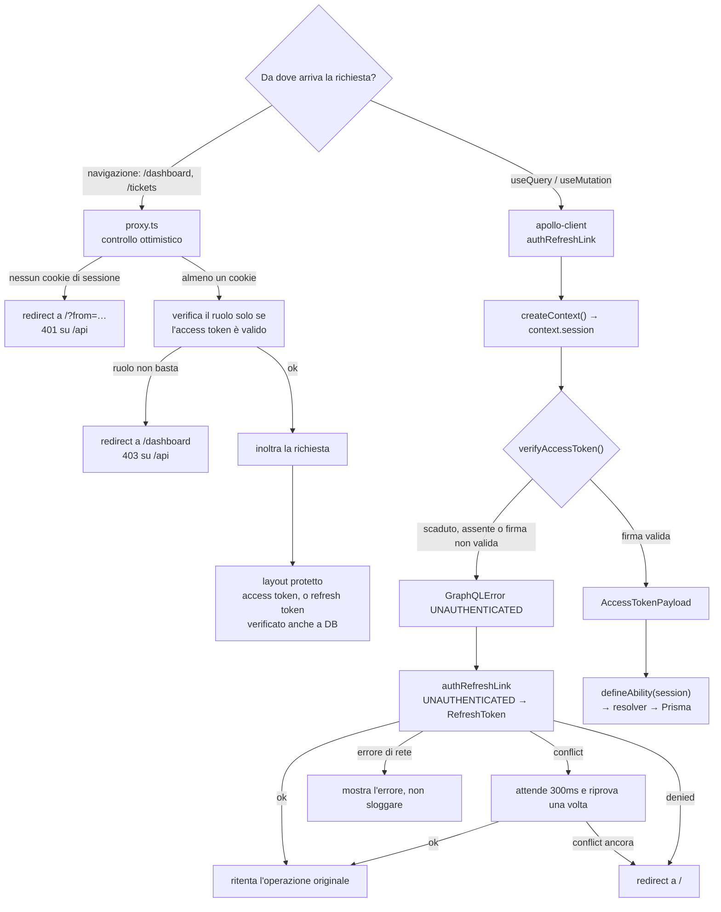

# Autenticazione

## In breve

L'utente fa un easylogin con credenziali preimpostate, pensato per la demo. Il
login genera due JWT e li scrive in cookie httpOnly. Da quel momento ogni
richiesta porta con sé i cookie, e il context accerta una volta sola chi sta
usando l'app: se il token non è scaduto e non è stato manomesso, la chiamata ai
resolver protetti va avanti. Altrimenti parte il refresh, dal client Apollo: non
è il proxy a rinnovare, è il link che reagisce all'errore e fa la chiamata. Il
refresh verifica il refresh token e ricrea entrambi.

Le mutation sono tre: `login`, il solo punto in cui si controllano le
credenziali; `refreshToken`, che **ruota** il refresh token verificando prima che
la riga nel database e il token firmato appartengano allo stesso utente;
`logout`, che chiude **tutte** le sessioni di quell'utente e cancella i cookie.

`refreshToken` ha un esito in più, `REFRESH_CONFLICT`: il token firmato è valido
ma la sua riga non è più in tabella, perché un'altra richiesta ha già ruotato
quella sessione. Non è un rifiuto, e per questo il resolver **non** tocca i
cookie: cancellarli sarebbe peggio che non fare niente, perché l'utente ha già
dalla sua parte i token che quella richiesta vincente ha appena emesso.

## I token

Nati da [jose](https://github.com/panva/jose), che è senza dipendenze e gira sia
su Node sia sui runtime edge. Sono due, con **due segreti diversi** e lo stesso
algoritmo: a distinguerli è la chiave, quindi un refresh token non è utilizzabile
al posto di un access token.

```ts
export type AccessTokenPayload = {
  userId: number;
  role: Role;
  department: Department;
};

// il refresh token porta solo { userId }
```

`role` e `department` sono gli enum di Prisma e ci sono **per non interrogare il
database a ogni richiesta**: `defineAbility()` riceve l'`AccessTokenPayload` e ci
costruisce sopra le regole di tutti i domini, senza toccare Prisma. Il refresh
token non li porta, quindi al rinnovo serve comunque una query per ricostruire il
payload. L'access scade dopo **10 secondi**, il refresh dopo **1 giorno**.

Il `maxAge` del cookie supera di proposito la scadenza del suo token — 61 minuti
contro 10 secondi, 7 giorni contro 1 — perché il cookie deve sopravvivere al
proprio token, altrimenti non ci sarebbe nulla da rinnovare.

La riga in tabella ha la stessa scadenza del token firmato, un giorno. Non deve
sopravvivergli: se restasse in tabella più a lungo di quanto vale il token che la
rende valida, nessuno potrebbe più ripulirla, perché il logout per chiudere le
sessioni ha bisogno del cookie del refresh, e a quel punto è già sparito. A durare
di più è solo il cookie, e di proposito: sette giorni per non doverlo riscrivere a
ogni rotazione.

Viaggiano in cookie, non in header: è il browser a doverli allegare a ogni
richiesta, e il frontend non deve poterli leggere.

```ts
{
  httpOnly: true,                                  // il frontend non può leggerli
  secure: process.env.NODE_ENV === "production",  // HTTPS, ma non in sviluppo
  sameSite: "lax",                                 // niente POST da altri siti
  path: "/",                                       // letti anche su /api/graphql
}
```

Si scrivono con `cookies()` di `next/headers`, che è asincrono e va messo in
`await`, e solo dentro una Route Handler o una Server Action.

A leggerli e a capire chi è l'utente è `graphql/context.ts`. Non decifra: `jose`
firma in modo simmetrico e il payload è in base64url, leggibile da chiunque abbia
il token. `createContext()` legge il cookie `access_token`, chiama
`verifyAccessToken()` e mette il risultato in `context.session`. La fonte è **solo
il cookie**: `/api/graphql` è in `PUBLIC_PATHS`, quindi il proxy non ha header
d'identità da inoltrarle. `requireSession()` è il controllo, ed è un metodo del
context: non rilegge i cookie e solleva `UNAUTHENTICATED` se manca.

```ts
const session = context.requireSession();
const ability = defineAbility(session);
const prisma = await getPrisma();
```

## Il flusso normale



## Il refresh

Il caso buono si esaurisce in una riga. Quello che lo complica è che il refresh
non passa da un unico posto: lo chiede il link Apollo, e il proxy non c'entra.
Le pagine protette e le chiamate all'API vengono controllate in due modi
diversi, ma al rinnovo arriva solo il client.



Il proxy non rinnova mai, e non fa la chiamata a sé stesso. Controlla solo che
esista almeno un cookie di sessione: decidere sulla scadenza dell'access token
significherebbe mandare via utenti che hanno un refresh token valido, e il
rinnovo è già la strada che passa dal client. Perciò non c'è nessun
`Set-Cookie` da incollare nella risposta inoltrata, e le 401 arrivano solo dal
caso in cui i cookie non ci sono affatto.

Il layout protetto è il secondo controllo, e ha un fallback suo: se l'access
token non è valido, non si arrende, verifica il refresh token e cerca la sua
riga in tabella, così può comunque sapere **chi** è l'utente e costruire
l'ability. In quel caso il ruolo e il dipartimento non può leggerli dal token
firmato, perché l'access token non ce l'ha: li rilegge dal database.

**GraphQL risponde sempre 200**, anche quando la mutation fallisce, quindi
l'esito si legge dentro il body: `data.refreshToken.success` dice se è andata,
e quando è falso bisogna guardare `json.errors` per sapere *perché*. È lì che
sta la distinzione su cui il link decide: `REFRESH_CONFLICT` non è un logout, è
una corsa.

`authRefreshLink` sta tra `loadingLink` e `httpLink`. I dettagli che contano:

- **`RefreshToken`, `Login` e `Register` sono escluse** dal ciclo: senza questa
  guardia un login respinto riporterebbe l'utente al login, per sempre.
- **`refreshing` è una promise condivisa**: più query che falliscono insieme
  fanno un solo refresh e poi vengono ritentate tutte. Il refresh usa una `fetch`
  diretta invece di passare da Apollo, altrimenti rientrerebbe nel link e si
  auto-invocherebbe.
- **Il ritentativo dell'operazione è uno solo**, e dietro c'è un secondo livello
  di attesa che sta nel refresh: sul `REFRESH_CONFLICT` aspetta 300ms e riprova
  una volta. Se il conflitto persiste, è un rifiuto vero e l'utente torna a `/`.
- **Non ogni errore è un logout.** Un `UNAUTHENTICATED` è un rifiuto e porta a
  `/`, ma un errore di rete o un 500 lasciano l'utente dov'è: il link restituisce
  l'errore originale e non sblocca niente.

Il refresh passa anche dai Web Locks, e il nome del lock è lo stesso in tutte le
tab: due tab che invecchiano il token insieme non fanno due refresh. E se un
refresh è riuscito meno di 3 secondi fa, il successivo non ruota niente: la
richiesta fallita era solo partita con il token vecchio, e basta riprovarla.

Il parallelismo non è più un problema lato proxy, che non rinnova: è la rotazione
atomica a decidere. Delle richieste che arrivano insieme con lo stesso refresh
token una sola cancella la riga, le altre ricevono `REFRESH_CONFLICT` e si
riprendono con i cookie che il vincitore ha appena messo nel browser.

Il link guarda solo `result.errors`, e non ha un `catchError`: è
`errorPolicy: "all"` di default su mutate e watchQuery a far arrivare lì anche
gli errori che Apollo di solito lancerebbe.

## Le sessioni e i dispositivi

`RefreshToken` ha `token` univoco e `userId` no, e l'asimmetria è voluta: un utente
può avere più sessioni aperte, una per dispositivo. Ogni refresh token porta un
`jti` casuale, altrimenti due token dello stesso utente emessi nello stesso
secondo sarebbero identici e il secondo fallirebbe sul vincolo unico.

`login` però non è innocuo: se nel browser c'è già un refresh token, cancella
quella riga e i cookie prima di emetterne uno nuovo. Chi rientra dalla pagina di
login non lascia quindi una seconda sessione viva sulla stessa macchina, mentre
le sessioni degli altri dispositivi restano aperte.

`logout` invece cancella **tutte** le righe di quell'utente, e per farlo prende
l'`userId` dal token firmato invece che dal database: la firma resta valida anche
dove la riga è già stata cancellata, quindi il logout chiude tutte le sessioni
proprio nel caso in cui il token è stato rubato e ruotato via alla vittima. Non
impedisce il furto, che dura al massimo un giorno, ma lo chiude con un colpo solo.

