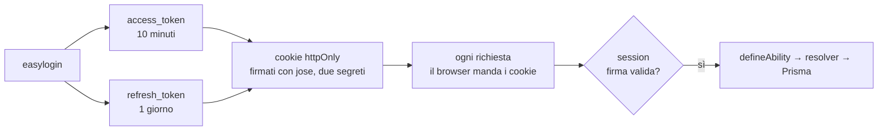
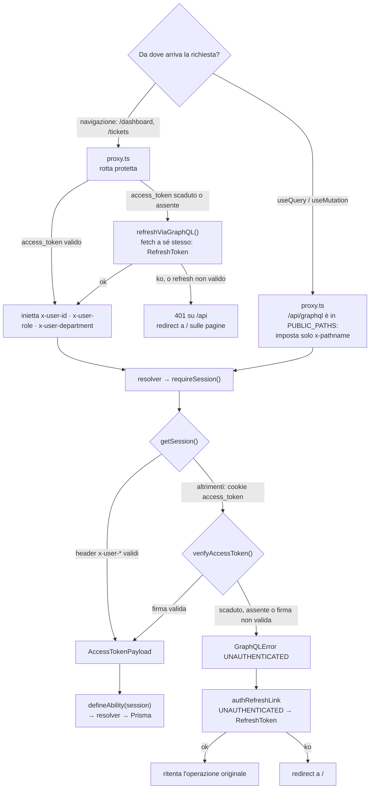

# Autenticazione

## In breve

L'utente fa un easylogin con credenziali preimpostate, pensato per la demo. Il
login genera due JWT e li scrive in cookie httpOnly. Da quel momento ogni
richiesta porta con sé i cookie, e i resolver protetti usano `session` per
accertare chi sta usando l'app: se il token non è scaduto e non è stato
manomesso, la chiamata va avanti. Altrimenti parte il refresh, che verifica il
refresh token e ricrea entrambi.

Le mutation sono tre: `login`, il solo punto in cui si controllano le
credenziali; `refreshToken`, che **ruota** il refresh token cancellando il record
vecchio prima di crearne uno nuovo; `logout`, che cancella il record e i cookie.

## I token

Nati da [jose](https://github.com/panva/jose), che è senza dipendenze e gira sia
su Node sia sui runtime edge. Sono due, con **due segreti diversi** e lo stesso
algoritmo: a distinguerli è la chiave, quindi un refresh token non è utilizzabile
al posto di un access token.

```ts
export type AccessTokenPayload = {
  userId: number;
  role: Role;
  department: Department;
};

// il refresh token porta solo { userId }
```

`role` e `department` sono gli enum di Prisma e ci sono **per non interrogare il
database a ogni richiesta**: `defineAbility()` riceve l'`AccessTokenPayload` e ci
costruisce sopra le regole di tutti i domini, senza toccare Prisma. Il refresh
token non li porta, quindi al rinnovo serve comunque una query per ricostruire il
payload. L'access scade dopo **10 minuti**, il refresh dopo **1 giorno**.

Viaggiano in cookie, non in header: è il browser a doverli allegare a ogni
richiesta, e il frontend non deve poterli leggere.

```ts
{
  httpOnly: true,                                  // il frontend non può leggerli
  secure: process.env.NODE_ENV === "production",  // HTTPS, ma non in sviluppo
  sameSite: "lax",                                 // niente POST da altri siti
  path: "/",                                       // letti anche su /api/graphql
}
```

Il `maxAge` supera la scadenza del token — 61 minuti contro 10, 7 giorni contro 1
— perché il cookie deve sopravvivere al proprio token, altrimenti non ci sarebbe
nulla da rinnovare. Si scrivono con `cookies()` di `next/headers`, che è asincrono
e va messo in `await`, e solo dentro una Route Handler o una Server Action.

A leggerli e a capire chi è l'utente è `lib/auth/session.ts`. Non decifra: `jose`
firma in modo simmetrico e il payload è in base64url, leggibile da chiunque abbia
il token. `getSession()` guarda prima gli header, poi il cookie, e
`requireSession()` è `getSession()` più il controllo:

```ts
const session = await requireSession();
const ability = defineAbility(session);
const prisma = await getPrisma();
```

## Il flusso normale



## Il refresh

Il caso buono si esaurisce in una riga. Quello che lo complica è che **non è
un'unica strada**: le pagine protette e le chiamate all'API vengono controllate
in due modi diversi, e ognuno ha il suo refresh.




Il refresh del proxy è una chiamata **da server a server**: passa il cookie
arrivato, riceve i `Set-Cookie` e li allega alla risposta che inoltra, così il
browser salva i token nuovi senza che nessun JavaScript li tocchi.

**GraphQL risponde sempre 200**, anche quando la mutation fallisce. Perciò
`refreshRes.ok` non basta e serve guardare anche il body (`proxy.ts:134-139`):
senza il controllo su `json.errors` un refresh token scaduto passerebbe per un
rinnovo riuscito.

`authRefreshLink` sta tra `loadingLink` e `httpLink`. Tre dettagli contano:

- **`Login`, `Register` e `RefreshToken` sono escluse** dal ciclo: senza questa
  guardia un login respinto riporterebbe l'utente al login, per sempre.
- **`refreshing` è una promise condivisa**: più query che falliscono insieme
  fanno un solo refresh e poi vengono ritentate tutte. Il proxy non ha un guard
  uguale, e sui prefetch in parallelo di Next succede che vince il primo refresh
  e gli altri trovano il token già ruotato, quindi 401.
- **Il ritentativo è uno solo**, e il refresh usa una `fetch` diretta invece di
  passare da Apollo, altrimenti rientrerebbe nel link e si auto-invocherebbe.

Lo stesso errore si presenta in due forme, e il link le copre entrambe: con
`errorPolicy: "all"` finisce in `result.errors`, altrimenti viene lanciato e
finisce in `catchError`.


**NOTE**

Il flusso di autenticazione è impostato così da restare indipendente dalla libreria scelta per
l'API. Il punto in cui la scelta si fa sentire è il refresh, che il proxy
chiama per nome: passare a un'altra libreria significa aggiornare l'indirizzo di
quella chiamata e l'errore che `session.ts` espone, mentre il codice che
stabilisce l'identità dell'utente resta invariato. È per questo che il progetto
non usa il context di Apollo.