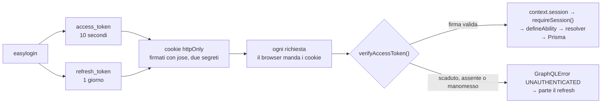
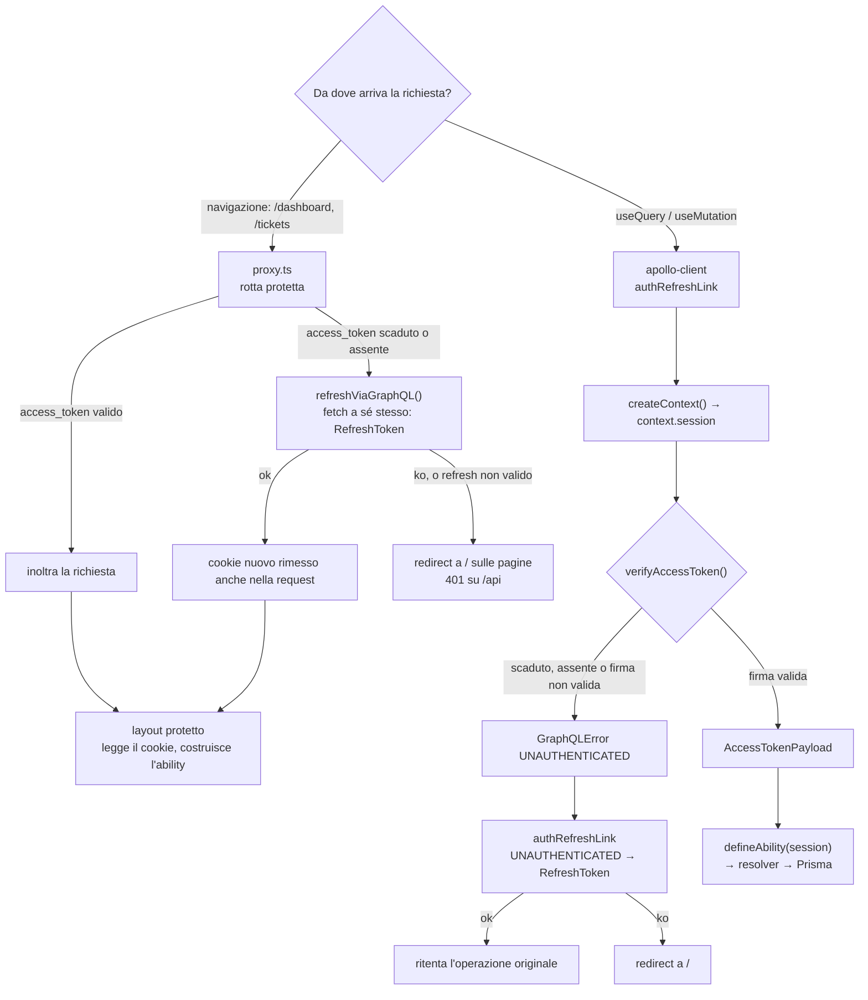

# Autenticazione

## In breve

L'utente fa un easylogin con credenziali preimpostate, pensato per la demo. Il
login genera due JWT e li scrive in cookie httpOnly. Da quel momento ogni
richiesta porta con sé i cookie, e il context accerta una volta sola chi sta
usando l'app: se il token non è scaduto e non è stato manomesso, la chiamata ai
resolver protetti va avanti. Altrimenti parte il refresh, che verifica il
refresh token e ricrea entrambi.

Le mutation sono tre: `login`, il solo punto in cui si controllano le
credenziali; `refreshToken`, che **ruota** il refresh token verificando prima che
la riga nel database e il token firmato appartengano allo stesso utente;
`logout`, che chiude **tutte** le sessioni di quell'utente e cancella i cookie.

## I token

Nati da [jose](https://github.com/panva/jose), che è senza dipendenze e gira sia
su Node sia sui runtime edge. Sono due, con **due segreti diversi** e lo stesso
algoritmo: a distinguerli è la chiave, quindi un refresh token non è utilizzabile
al posto di un access token.

```ts
export type AccessTokenPayload = {
  userId: number;
  role: Role;
  department: Department;
};

// il refresh token porta solo { userId }
```

`role` e `department` sono gli enum di Prisma e ci sono **per non interrogare il
database a ogni richiesta**: `defineAbility()` riceve l'`AccessTokenPayload` e ci
costruisce sopra le regole di tutti i domini, senza toccare Prisma. Il refresh
token non li porta, quindi al rinnovo serve comunque una query per ricostruire il
payload. L'access scade dopo **10 secondi**, il refresh dopo **1 giorno**.

Il `maxAge` del cookie supera di proposito la scadenza del suo token — 61 minuti
contro 10 secondi, 7 giorni contro 1 — perché il cookie deve sopravvivere al
proprio token, altrimenti non ci sarebbe nulla da rinnovare.

Viaggiano in cookie, non in header: è il browser a doverli allegare a ogni
richiesta, e il frontend non deve poterli leggere.

```ts
{
  httpOnly: true,                                  // il frontend non può leggerli
  secure: process.env.NODE_ENV === "production",  // HTTPS, ma non in sviluppo
  sameSite: "lax",                                 // niente POST da altri siti
  path: "/",                                       // letti anche su /api/graphql
}
```

Si scrivono con `cookies()` di `next/headers`, che è asincrono e va messo in
`await`, e solo dentro una Route Handler o una Server Action.

A leggerli e a capire chi è l'utente è `graphql/context.ts`. Non decifra: `jose`
firma in modo simmetrico e il payload è in base64url, leggibile da chiunque abbia
il token. `createContext()` legge il cookie `access_token`, chiama
`verifyAccessToken()` e mette il risultato in `context.session`. La fonte è **solo
il cookie**: `/api/graphql` è in `PUBLIC_PATHS`, quindi il proxy non ha header
d'identità da inoltrarle. `requireSession()` è il controllo, ed è un metodo del
context: non rilegge i cookie e solleva `UNAUTHENTICATED` se manca.

```ts
const session = context.requireSession();
const ability = defineAbility(session);
const prisma = await getPrisma();
```

## Il flusso normale



## Il refresh

Il caso buono si esaurisce in una riga. Quello che lo complica è che **non è
un'unica strada**: le pagine protette e le chiamate all'API vengono controllate
in due modi diversi, e ognuno ha il suo refresh.



Il refresh del proxy è una chiamata **da server a server**: passa il cookie
arrivato, riceve i `Set-Cookie` e li allega alla risposta che inoltra, così il
browser salva i token nuovi senza che nessun JavaScript li tocchi. Li rimette
anche nella **richiesta**, perché un proxy può scrivere cookie solo in uscita:
senza quel passaggio l'access token nuovo arriverebbe al browser ma resterebbe
invisibile al layout, che lo rilegge in quello stesso ciclo.

**GraphQL risponde sempre 200**, anche quando la mutation fallisce. Perciò
`refreshRes.ok` non basta e serve guardare anche il body: senza il controllo su
`json.errors` un refresh token scaduto passerebbe per un rinnovo riuscito.

`authRefreshLink` sta tra `loadingLink` e `httpLink`. Tre dettagti contano:

- **`RefreshToken`, `Login` e `Register` sono escluse** dal ciclo: senza questa
  guardia un login respinto riporterebbe l'utente al login, per sempre.
- **`refreshing` è una promise condivisa**: più query che falliscono insieme
  fanno un solo refresh e poi vengono ritentate tutte. Il proxy non ha un guard
  uguale, e sui prefetch in parallelo di Next succede che vince il primo refresh
  e gli altri trovano il token già ruotato, quindi 401.
- **Il ritentativo è uno solo**, e il refresh usa una `fetch` diretta invece di
  passare da Apollo, altrimenti rientrerebbe nel link e si auto-invocherebbe.

Lo stesso errore si presenta in due forme, e il link le copre entrambe: con
`errorPolicy: "all"` finisce in `result.errors`, altrimenti viene lanciato e
finisce in `catchError`.

## Le sessioni e i dispositivi

`RefreshToken` ha `token` univoco e `userId` no, e l'asimmetria è voluta: un utente
può avere più sessioni aperte, e `login` ne crea una nuova senza toccare le altre.
Ogni refresh token porta un `jti` casuale, altrimenti due login dello stesso
utente nello stesso secondo produrrebbero lo stesso token e il secondo fallirebbe
sul vincolo unico.

`logout` invece cancella **tutte** le righe di quell'utente, e per farlo prende
l'`userId` dal token firmato invece che dal database: la firma resta valida anche
dove la riga è già stata cancellata, quindi il logout chiude tutte le sessioni
proprio nel caso in cui il token è stato rubato e ruotato via alla vittima. Non
impedisce il furto, che dura al massimo un giorno, ma lo chiude con un colpo solo.

