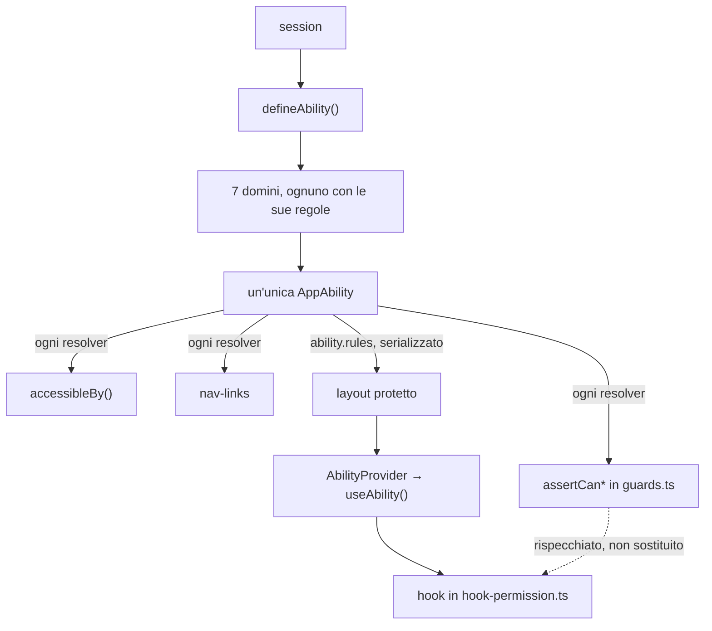

# CASL

## Cos'è CASL

CASL è la libreria con cui il progetto decide se un utente può fare qualcosa.

Una regola ha tre parti: un'azione, un subject (l'oggetto su cui si agisce) e
una condizione. Le regole si scrivono tutte in anticipo, poi sull'ability si
fanno domande del tipo "può fare questo?", e la risposta è un sì o un no.

In questo progetto le regole non stanno tutte insieme: ogni dominio
(`ticket`, `user`, `category`, ...) scrive le proprie e le espone come ability
autonoma. Un unico file le mette tutte insieme e ne fa l'ability dell'applicazione,
che viene usata identica dal backend e dal frontend.

Su cosa sono e come si usano `can`, `cannot` e `subject` la documentazione è
quella della libreria, su [casl.js.org](https://casl.js.org/). Qui e nei documenti
di dominio si documentano solo le scelte di questo progetto.

## Il percorso



Da un solo oggetto partono due strade. A sinistra l'ability viene usata sul
posto, a ogni richiesta: è lì che nasce l'autorizzazione. A destra le stesse
regole attraversano il layout come semplici dati e vengono ricostruite nel
browser, dove servono a costruire l'interfaccia. La linea tratteggiata dice che
il ramo destro è la copia del sinistro, non un secondo controllo.

## Backend — `defineAbility.ts`

È il punto in cui i domini si incontrano, e l'unico file che li vede tutti.
`defineAbility(session)` chiama `defineAbilityFor<Dominio>` per ognuno dei sette
domini, passandogli il token payload dell'utente, mette tutte le regole in un
unico array e restituisce l'ability risultante. Non decide nulla: la decisione
avviene dopo, su quell'oggetto.

```ts
const ability = defineAbility(session);
if (ability.cannot("update", subject("Ticket", existing), "priority")) {
  // negato
}
```

I domini sono combinabili perché ciascuno dichiara subject col nome proprio:
le regole di un dominio non possono quindi alterare l'esito dei check di un
altro. I domini non si importano a vicenda in nessun punto.

### I domini

| Dominio | Subject | Azioni | Regole in |
| --- | --- | --- | --- |
| ticket | `Ticket`, `TicketMessage` | create, read, update, delete, browseAssignees | `abilities/ticket/rules.ts` |
| user | `User` | read, updateRole, manageSpecialization | `abilities/user/rules.ts` |
| category | `TicketCategory`, `TicketCategoryAccess` | manage, read, create, update, delete, restore | `abilities/category/rules.ts` |
| ticket-notification | `TicketNotification` | create, read, delete | `abilities/ticket-notification/rules.ts` |
| stats | `TicketStats` | read, readAll | `abilities/stats/rules.ts` |
| ticket-history | `TicketHistory` | read | `abilities/ticket-history/rules.ts` |
| ticket-scope | `TicketScope` | read | `abilities/ticket-scope/rules.ts` |

Ogni dominio scrive anche i propri `assertCan*` in `guards.ts`, che i resolver
chiamano per fare rispettare le regole. Un dominio senza `guards.ts` è un
dominio senza istanze da valutare: `stats` controlla solo il tipo di azione
consentita, quindi non ha bisogno del file.

Per le liste il meccanismo è diverso: invece di un assert, il resolver traduce
le regole di lettura in un filtro Prisma con `accessibleBy`, così non deve
fetchare tutto e scartare lato applicativo.

### Aggiungere un dominio

Un dominio nuovo si aggiunge in quattro file nella sua cartella — `types.ts`
(subject e azioni), `rules.ts` (le regole), `guards.ts` (gli assert, se serve),
`hook-permission.ts` (gli hook, se serve alla UI) — e in cinque punti di
`defineAbility.ts`: l'import della funzione, l'import dei tipi, `AppActions`,
`AppSubjects` e la riga che estende le regole.

`abilityContext.tsx` non va toccato.

## Frontend — `abilityContext.tsx`

Le regole che il layout ha calcolato passano come dati a `AbilityProvider`, che
le ricostruisce in un'ability funzionante nel browser e la espone tramite
`useAbility()`. È lo stesso oggetto costruito a partire dalle stesse regole,
quindi i due lati non possono divergere.

Sul client non si ricalcola niente, perché non si potrebbe: manca il token
payload e manca il database.

Il layout viene ricalcolato a ogni render, quindi se cambia il ruolo o il reparto
dell'utente l'ability cambia con lui. Navigando fra ticket le regole invece non
cambiano mai, perché sono condizionali sull'utente e non sull'oggetto — la
differenza di permessi fra due ticket la produce la valutazione della condizione
sul subject, non un insieme di regole diverso.

### Cosa se ne fa il frontend

Mostrare, nascondere, disabilitare. I check del frontend non passano dagli
`assertCan*` di `guards.ts` — quelli sono enforcement server e lanciano
`FORBIDDEN` — ma dagli hook che ogni dominio espone in `hook-permission.ts`
(`useTicketUpdatePermissions`, `useCategoryManagementPermissions`, ...).

Non è un confine di sicurezza: serve a non offrire all'utente controlli che il
server rifiuterebbe comunque. Se un check può far fallire una mutation, la
verifica che conta è l'`assert` chiamato dal resolver.

## Note

**`detectSubjectType` ha due implementazioni.** Sul server (`defineAbility.ts`)
riconosce il subject in tre modi, perché lì gli oggetti arrivano da Prisma e
non hanno un tipo: il tag `__caslSubjectType__` posto da `subject(...)`, il
`__typename` degli oggetti GraphQL, e come ultima risorsa il nome del
costruttore. Sul client (`abilityContext.tsx`) basta `__typename`, perché lì i
dati arrivano tutti da GraphQL. Ne segue un vincolo: i check su oggetti costruiti
a mano, senza `__typename`, falliscono in silenzio. I check con subject stringa
e le regole senza condizioni non passano da qui e non ne risentono.

**Le regole senza condizioni non dipendono dall'oggetto.** Sono i check in cui
l'azione è consentita a chiunque, per esempio `can("read", "User")` per il
system admin: il subject si può passare come stringa e la risposta non cambia.

Le regole di ogni dominio — chi può fare cosa, in quale stato — sono in
`domains/<dominio>/casl.md`.
