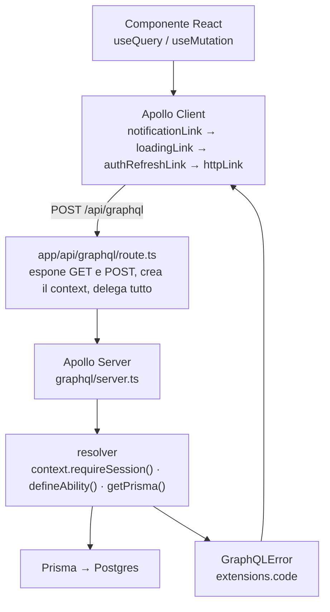
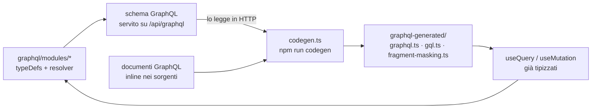
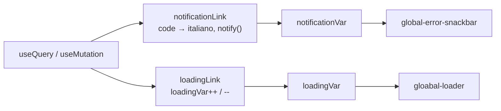

# Data flow

Come una richiesta attraversa l'applicazione, dal componente React fino al
database e di nuovo indietro.

GraphQL è il contratto fra le due metà: il backend dichiara la forma dei dati,
il frontend la chiede. Su come sono definiti i permessi e su come i domini
diventano un'unica ability, vedi [casl.md](casl.md). Su chi stabilisce l'utente
e su come i token si rinnovano, vedi [auth.md](auth.md).

Il linguaggio in sé è quello di [graphql.org](https://graphql.org/) e la
documentazione del client è su [apollographql.com](https://www.apollographql.com/docs/react/).
Qui si documentano solo le scelte di questo progetto.

## Il percorso



Cinque strati, e ognuno ha un compito solo: il componente chiede, i link
aggiungono quello che serve a tutti (notifiche, loading, rinnovo del token), il
route handler non contiene logica, il resolver contiene il caso d'uso, Prisma
esegue. L'ultima freccia è chiusa: quello che il resolver sbaglia torna
indietro come `GraphQLError` e lo gestisce il link, non il componente.

## Backend — il server GraphQL e l'API

Il server GraphQL viene esposto tramite un Route Handler di Next.js (App
Router), all'endpoint `/api/graphql`. L'integrazione è realizzata con il
pacchetto `@as-integrations/next`, la cui funzione
`startServerAndCreateNextHandler` avvia l'istanza di Apollo Server e produce
un handler compatibile con le API Web `Request`/`Response` di Next. Lo stesso
handler viene riesportato sia come `POST`, che è il metodo usato dai client per
inviare query e mutation, sia come `GET`, necessario per le query passate
via URL e per l'accesso ad Apollo Sandbox in fase di sviluppo. In questo modo
il backend GraphQL vive nella stessa applicazione del frontend, senza
richiedere un server separato: stesso processo, stesso deploy, stessa
configurazione.

L'istanza di Apollo Server è definita in `graphql/server.ts` e registra
soltanto lo schema e i resolver:

```ts
export const server = new ApolloServer<GraphQLContext>({
  typeDefs,
  resolvers,
});
```

Da Apollo Server 5 il `context` non è più un'opzione del costruttore ma
un parametro dell'handler, e il progetto lo sfrutta per costruirlo una volta per
operazione. `createContext()` in `graphql/context.ts` legge il cookie
`access_token`, chiama `verifyAccessToken()` e mette il risultato in
`context.session`:

```ts
export type GraphQLContext = {
  session: AccessTokenPayload | null;
  requireSession: () => AccessTokenPayload;
};
```

La fonte è **solo il cookie**: `/api/graphql` è in `PUBLIC_PATHS`, quindi l'identità
arriva dal cookie che il browser ha già allegato, e il proxy non ha modo di
aggiungerci niente. Il context è l'unico posto in cui viene risolta, e i resolver
non rileggono mai i cookie.

**`session` può essere `null`, e va controllato.** `requireSession()` fa
esattamente questo: non rilegge i cookie, prende il valore che il context ha già
risolto e solleva `UNAUTHENTICATED` se manca. Ogni resolver protetto chiama
`context.requireSession()` per intero, quindi l'obbligo di autenticazione resta in
testa alla funzione invece di essere ereditato da un parametro che ci si può
dimenticare. Il ragionamento è in [auth.md](auth.md).

### Lo schema è modulare

Ogni cartella sotto `graphql/modules/` porta i propri `typeDefs` e i propri
resolver, e `graphql/schema.ts` li mette insieme. I resolver si spreads dentro
`Query` e `Mutation`, più tre mappe per i **field resolver** — `Ticket`,
`TicketSpecific` e `User` — che risolvono un campo senza passare da una query
nuova.

`graphql/root.ts` contiene solo la radice: `Query`, `Mutation` e i tipi condivisi
come `PageInfo` e `SortDirection`.

### Il contratto del resolver

Un resolver protetto fa sempre le stesse tre cose, e in quest'ordine:

```ts
const session = context.requireSession();
const ability = defineAbility(session);
const prisma = await getPrisma();
```

La sessione decide **se** la chiamata passa, l'ability decide **quanto** passa,
Prisma esegue. Quando qualcosa non torna, il resolver non lancia un'eccezione
qualsiasi: solleva `GraphQLError` con un `extensions.code`, e quel codice è il
contratto con il frontend. Le regole sono in [AGENTS.md](../../AGENTS.md).

**Nessuna query è pubblica.** Ogni resolver in `queries.ts` chiama
`context.requireSession()`, e non è una scelta sulla carta: la prima fonte della
sessione è il cookie, e il cookie lo manda il browser, quindi una query aperta
servirebbe a chi non ha ancora un access token — cioè a chi non ha ancora fatto il
login. Le uniche operazioni che restano aperte sono le mutation di auth e demo
(`login`, `createUser`, `refreshToken`, `logout`, `startDemo`), che per definizione
non possono chiedere una sessione: servono a ottenerla, o a chiuderla.

Le query che il frontend usa per il montaggio iniziale, come `me` o
`usersByDepForLogin`, non fanno eccezione: chiedono la sessione come tutte le
altre.

### Aggiungere un modulo

Un modulo nuovo si aggiunge in due file nella sua cartella — `typeDefs.ts` e i
suoi resolver — e in quattro punti di `schema.ts`: due import e due voci negli
array. `server.ts`, il route handler e il frontend non si toccano.

## Il codegen

È il punto in cui le due metà si incontrano davvero, e la ragione per cui in
questo progetto non esiste una sola interfaccia scritta a mano.



`codegen.ts` fa due cose. Legge lo **schema** dal server, e legge i **documenti**
che il frontend scrive. Incrociando i due produce i tipi in `graphql-generated/`:

- **`graphql.ts`** i tipi di ogni query, mutation e fragment
- **`gql.ts`** la funzione `gql` e i documenti già compilati
- **`fragment-masking.ts`** `useFragment`, che impedisce di leggere un fragment
  senza aver chiesto i suoi campi

L'effetto è che il tipo di una riga di tabella non si dichiara: si indica.

```ts
type DepartmentStatsSource = TicketStatsByDepartmentQuery["ticketStatsByDepartment"];
```

Il tipo viene dalla query, quindi non può divergere da lei, e non esistono DTO
da tenere allineati a mano. `Date` è mappato su `string`, perché sul client
arriva già serializzato.

## Frontend — `apollo-client.ts`

`createApolloClient()` mette insieme la catena di link, la cache e i default.
L'ordine dei link non è casuale:

```ts
link: ApolloLink.from([
  notificationLink,
  loadingLink,
  authRefreshLink,
  httpLink,
]),
```

`notificationLink` per primo, perché è il più esterno e deve vedere il
**risultato finale**, dopo che `authRefreshLink` ha avuto la sua possibilità di
ritentare. `httpLink` per ultimo, perché è l'unico che esce davvero dalla rete.
`credentials: "same-origin"` serve perché token e sessione demo stanno nei
cookie.

`InMemoryCache` ha `typePolicies` su `Query` perché il default di Apollo non sa
nulla di liste paginate: senza, ogni pagina di una lista sostituirebbe la
precedente. **Quali campi e con quali `keyArgs` è una scelta di dominio**, e sta
nel documento di ciascun dominio.

Sul server `paginateByCursor` chiede una riga in più del necessario per capire
se esiste una pagina successiva, poi la scarta: costa una riga e fa risparmiare
una `count` separata.

### I link centralizzati: errori e loading

Due problemi che riguardano tutta l'applicazione, risolti una volta sola ciascuno
da un link, e letti da un componente che non sa nulla dell'uno e dell'altro.

| Link | Variabile | Chi legge |
| --- | --- | --- |
| `notificationLink` | `notificationVar` | `components/global-error-snackbar.tsx` |
| `loadingLink` | `loadingVar` | `components/gloabal-loader.tsx` |



Il contratto è che **il componente non chiama `notify()` e non tiene un
contatore**: legge una `ReactiveVar` con `useReactiveVar` e basta. Un componente
che mostra uno spinner suo non vede le altre richieste in volo, e uno che chiama
`notify` a mano duplica una traduzione che già esiste.

`loadingVar` conta le **operazioni logiche**, non le chiamate HTTP: se
`authRefreshLink` ritenta, il contatore non sale e scende due volte, perché il
ritentativo avviene dentro la stessa pipe. Sopra zero significa che qualcosa è
in carico.

`notificationLink` fa tre cose: traduce `extensions.code` in italiano, mostra la
notifica di successo delle mutation, e sui `FORBIDDEN` redirige alla dashboard.
Il messaggio di successo si dichiara per operazione nel `context` della
mutation, con `successMessage` e `silent`. Le regole di questo flusso sono in
[AGENTS.md](../../AGENTS.md).

## Note

**`errorPolicy: "all"` è il default** sia per `mutate` sia per `watchQuery`, e ha
una conseguenza che va ricordata: la promise di una mutation **non rilancia
mai**. Quando arriva un `GraphQLError` la promise si risolve comunque, con
`error` valorizzato e `data` parziale. Quindi un `try/catch` attorno ad
`await mutate(...)` non cattura niente, e `onCompleted` viene chiamato anche se
la mutation è fallita. Per questo le notifiche le gestisce il link.

**`codegen.ts` legge lo schema in HTTP**, da `http://localhost:3000/api/graphql`.
Per generare i tipi il dev server deve essere acceso: non basta un file.

**Non esiste un solo file `.graphql`** in tutto il progetto. Ogni documento è un
letterale `gql` dentro un `.tsx` o un `.ts`, ed è per questo che `documents`
punta ai sorgenti invece che a `*.graphql`.

**GraphQL risponde sempre 200**, anche quando la mutation fallisce: l'errore sta
in `errors` dentro il body. Chi chiama l'API non può guardare solo `res.ok`, e
`refreshViaGraphQL` in `proxy.ts` ne fa il caso esplicito.

**I due generatori hanno criteri diversi.** Il generator Prisma scrive in
`app/generated/prisma` e quella cartella è in `.gitignore`: si rigenera con
`npx prisma generate`. `graphql-generated/` invece è committato, perché i tipi
che ne derivano servono al typecheck del frontend e non si vogliono rigenerare a
ogni `npm install`.
