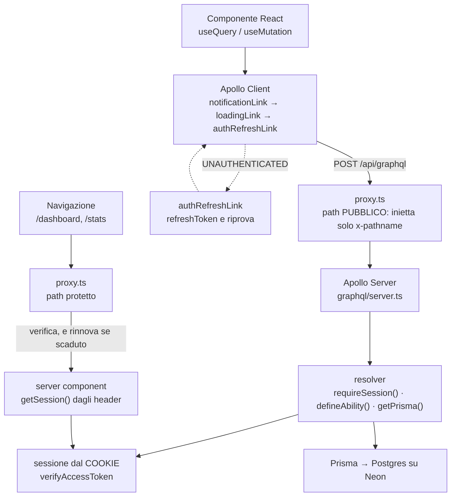

# Data flow

Come una richiesta attraversa l'applicazione, dal componente React fino al
database e di nuovo indietro.

Questo documento copre il percorso di una singola operazione GraphQL. Chi
vuole capire **come sono definiti i permessi** e come le regole dei domini
vengono unite in un'unica ability, legga [casl.md](casl.md).

## In breve

Una richiesta GraphQL attraversa quattro strati:

1. **Apollo Client** manda la richiesta, dopo averla fatta passare dai suoi link
2. **il proxy** la lascia passare: `/api/graphql` è un path pubblico
3. **Apollo Server** la decodifica e la indirizza al resolver giusto
4. **il resolver** verifica la sessione, costruisce l'ability, e chiede il
   client Prisma
5. **Prisma** esegue la query su Postgres

Il punto non ovvio è il secondo e il quarto: **la sessione non passa da Apollo
`context`**, e il proxy non la controlla. `graphql/server.ts` è scelta così per
non legare il fattore auth alla libreria scelta, e chi garantisce la sessione su
GraphQL è il resolver, rileggendo e verificando il token dal cookie.

## Il percorso

Due ingressi, e arrivano a sessioni diverse.



Le due strade del refresh non sono due difese sullo stesso caso: coprono
**situazioni diverse**. Il proxy rinnova quando si **naviga** su una pagina
protetta. `authRefreshLink` rinnova quando si **chiama** l'API e il token è
scaduto. Nessuno dei due è ridondante rispetto all'altro.

## Il proxy

`proxy.ts` è il middleware di Next e gira su ogni richiesta, ma **non tratta
GraphQL**.

`/api/graphql` è in `PUBLIC_PATHS`:

```ts
const PUBLIC_PATHS = [
  "/",
  "/api/graphql",   // login/register/refresh sono mutation pubbliche,
                    // le query/mutation protette restano protette a livello di resolver
];
```

Quindi per una chiamata GraphQL il proxy entra nel ramo pubblico, imposta solo
`x-pathname` e lascia passare. **Non verifica il token e non inietta
`x-user-*`.** La protezione di GraphQL è tutta nei resolver, come dice il
commento nel codice.

Sulle rotte **protette**, invece, il proxy fa tre cose:

- **verifica l'access token**, e se è scaduto prova a rinnovarlo chiamando la
  mutation `refreshToken` (`refreshViaGraphQL`)
- **inietta la sessione negli header** con `injectUserHeaders`:

  ```ts
  requestHeaders.set("x-user-id", String(payload.userId));
  requestHeaders.set("x-user-role", payload.role);
  requestHeaders.set("x-user-department", payload.department);
  requestHeaders.set("x-pathname", req.nextUrl.pathname);
  ```

- **risponde 401 o 403** se la richiesta non è autorizzata, in JSON per le
  rotte `/api` e con un redirect per le pagine

Da notare che GraphQL risponde **sempre 200**, anche quando c'è un errore
applicativo: l'errore sta nel campo `errors` del body. Per questo `refreshViaGraphQL`
non può guardare solo `refreshRes.ok` e deve leggere il body.

## Il route handler

`app/api/graphql/route.ts` è sottile di proposito: espone `GET` e `POST` e
delega tutto a `@as-integrations/next`, che adatta il ciclo di vita di Apollo
Server a quello di Next.

Non c'è logica qui dentro. Il server GraphQL vero è in `graphql/server.ts`, che
si limita a registrare `typeDefs` e `resolver`.

## Il server

`graphql/schema.ts` compone lo schema moduli per moduli: ogni cartella sotto
`graphql/modules/` porta il proprio `typeDefs.ts` e i propri `resolver`, e
`schema.ts` li mette tutti in un unico array. Aggiungere un dominio significa
aggiungere due import e due voci negli array, non modificare il centro.

## La sessione non passa da `context`

È la scelta che più sorprende chi legge il codice, quindi vale la pena
diciamolo esplicitamente: `graphql/server.ts` non ha una funzione `context`, e
`requireSession()` viene chiamato **dentro ogni resolver** invece che una volta
per richiesta.

`getSession()` ha due rami, e **non sono uno il ripiego dell'altro**: servono a
chiamanti diversi.

```ts
const userId = headersList.get("x-user-id");
const role = headersList.get("x-user-role");
const department = headersList.get("x-user-department");

if (userId && role && isValidRole(role) && department && isValidDepartment(department)) {
  return { userId: Number(userId), role, department };   // ramo header
}

const token = await getAccessToken();                   // ramo cookie
if (!token) return null;
return verifyAccessToken(token);
```

**Il ramo cookie è quello che gira su ogni chiamata GraphQL.** Il proxy non
inietta gli header su `/api/graphql`, quindi `headersList` è vuoto e la sessione
arriva verificando la firma del token. È il percorso normale, non una caduta.

**Il ramo header serve a chi sta sulle pagine.** I server component e le rotte
protette passano dal proxy, che ha già verificato il token e lo ha messo negli
header: lì il token non viene riverificato.

Entrambi i rami sono vivi, e `isValidRole` e `isValidDepartment` servono
proprio a validare il ramo header, perché un header è più facile da manometrare
di un claim firmato.

Il percorso della sessione cambia quindi con il chiamante:

```
chiamata GraphQL    →  cookie       →  verifyAccessToken  →  resolver
navigazione / page  →  proxy        →  header x-user-*    →  server component
```

### Una conseguenza: il refresh del link è obbligatorio

Se il proxy non guarda GraphQL, l'access token può scadere mentre l'utente è
seduto su una pagina aperta. La richiesta successiva arriva a `requireSession()`,
che trova il token scaduto e solleva `UNAUTHENTICATED`.

Quel `UNAUTHENTICATED` è un evento **frequente**, non un'anomalia: si presenta
ogni volta che passano i dieci minuti di durata dell'access token. Se
`authRefreshLink` non esistesse, la sessione morirebbe lì e l'unica via sarebbe
rifare il login.

Le prime tre righe di un resolver sono quindi quasi sempre queste:

```ts
const session = await requireSession();
const ability = defineAbility(session);
const prisma = await getPrisma();
```

## La sessione non passa da `context`

## Sul client

`createApolloClient()` in `apollo-client/apollo-client.ts` mette insieme la
catena di link, la cache e i default.

```ts
link: ApolloLink.from([
  notificationLink,
  loadingLink,
  authRefreshLink,
  httpLink,
]),
```

L'ordine non è casuale. `notificationLink` per primo, perché è il più esterno
e deve vedere il risultato finale, dopo che `authRefreshLink` ha avuto la sua
possibilità di riprovare. `httpLink` per ultimo, perché è quello che esce
davvero dalla rete.

`credentials: "same-origin"` serve perché token e sessione demo stanno nei
cookie: senza, il browser non li manderebbe.

### La catena dei link

| Link | Cosa fa |
| --- | --- |
| `notificationLink` | Traduce gli `extensions.code` in messaggi italiani e mostra le notifiche. Sui `FORBIDDEN` redirige alla dashboard. |
| `loadingLink` | Incrementa `loadingVar` a ogni operazione in volo e lo decrementa alla fine. |
| `authRefreshLink` | Se arriva `UNAUTHENTICATED`, rinnova il token e riprova l'operazione una volta sola. |
| `httpLink` | La richiesta vera, a `POST /api/graphql`. |

`loadingVar` conta le **operazioni logiche**, non le chiamate HTTP: se
`authRefreshLink` riprova, il contatore non sale e scende due volte, perché il
retry avviene dentro la stessa pipe. Un valore maggiore di zero significa che
qualcosa è in carico.

### Le due strade del refresh

Vale la pena saperlo, perché è la parte meno intuitiva di tutta la catena: **il
token viene rinnovato in due posti, e non sono ridondanti.**

- `proxy.ts` lo rinnova quando si **naviga** su una pagina protetta
- `authRefreshLink` lo rinnova quando si **chiama** l'API e il token è scaduto

Non coprono lo stesso caso, perché il proxy non vede `/api/graphql`. Se ne
togliessi uno, il sistema si romperebbe in un modo preciso: togliendo il link,
ogni sessione muore dopo dieci minuti di inattività; togliendo il proxy, la
navigazione tra pagine protette non funziona più.

Le tre operazioni escluse dal refresh sono `RefreshToken`, `Login` e `Register`:
altrimenti il rinnovo ne innescherebbe altri, all'infinito.

## La cache

`InMemoryCache` è configurata con `typePolicies` su `Query`, perché il default
di Apollo non sa nulla di liste paginate.

**`relayStylePagination`** sui cinque campi che restituiscono connessioni:

| Campo | `keyArgs` |
| --- | --- |
| `tickets` | `orderBy`, `filter`, `scope` |
| `ticketHistory` | `ticketId` |
| `users` | nessuno |
| `categories` | nessuno |
| `messages` | `ticketId` |

I `keyArgs` sono gli argomenti che identificano **dataset diversi**, quindi
liste diverse in cache. `first` e `after` non ci vanno mai: sono parametri di
paginazione, non di identità. Senza questa distinzione, la pagina 2 di una
lista sostituirebbe la pagina 1 in cache.

**`replacePolicy`** su `items` fa il contrario: la nuova risposta rimpiazza la
precedente, perché è una lista semplice.

**`categoryById`** usa `readFromCachePolicy`, che restituisce l'oggetto già in
cache, o un riferimento a `{ __typename, id }` se non c'è ancora. Serve per
non perdere gli oggetti parziali quando una query li restituisce senza tutti i
campi.

## `errorPolicy: "all"`

È il default sia per `mutate` che per `watchQuery`, e ha una conseguenza che
va ricordata: **la promise di una mutation non rilancia mai**.

Quando arriva un `GraphQLError`, la promise va risolta comunque, con `error`
valorizzato e `data` parziale. Quindi:

- un `try/catch` attorno ad `await mutate(...)` **non cattura** gli errori GraphQL
- `onCompleted` viene chiamato **anche se la mutation è fallita**

Per questo le notifiche di errore le gestisce `notificationLink` e non i
componenti, e per questo `AGENTS.md` vieta il `try/catch` con `notify` attorno
alle mutation.

## Paginazione

`paginateByCursor` in `graphql/pagination/pagination.ts` è il helper usato dai
resolver. La sua parte non ovvia è `take = first + 1`:

```ts
const first = args.first ?? options.defaultPageSize ?? 20;
const take = first + 1;

const items = await options.fetchPage({ take, ... });

const hasNextPage = items.length > first;
const nodes = hasNextPage ? items.slice(0, first) : items;
```

Chiede una riga in più del necessario per **capire se esiste una pagina
successiva**, poi la scarta. Costa una riga in più dal database e fa risparmiare
una `count` separata.

Il `cursor` è l'`id` dell'ultimo nodo, convertito in stringa. `endCursor` torna
`null` quando la pagina è vuota, e i consumer devono gestirlo.

## Quale database

`getPrisma()` non restituisce sempre il client di produzione: con
`USE_NEON_BRANCHING` attivo restituisce il client del branch associato alla
sessione demo corrente. È la parte del percorso che va spiegata per bene, e
avrà un documento suo.

Quello che basta sapere qui è che **la scelta del database avviene per
richiesta**, e che passa da `getPrisma()` in 47 punti fra resolver e layout.

## Errori e notifiche

Il flusso degli errori è definito in [AGENTS.md](../../AGENTS.md), che resta la
sede giusta: il backend solleva `GraphQLError` con un messaggio inglese e un
`extensions.code`, `notificationLink` lo traduce in italiano e mostra la
notifica.

L'unica cosa da ricordare qui è che `graphqlErrorMessages` sta in
`notification-link.ts`, e **ogni `extensions.code` nuovo deve avere una voce in
quel file**. Senza, l'utente legge il messaggio pensato per chi sviluppa.
