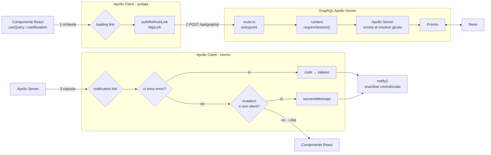

# Data flow

Come una richiesta attraversa l'applicazione, dal componente React fino al
database e di nuovo indietro. GraphQL è il contratto fra le prime due metà: chi
stabilisce l'utente è in [auth.md](auth.md), come i permessi diventano un'unica
ability è in [casl.md](casl.md).

## Gli attori

Tre, e ognuno sta su un lato diverso:

- **Apollo Client** (`apollo-client/`), nel browser: è ciò con cui il componente
  chiede e riceve.
- **GraphQL Server** (`graphql/` e `app/api/graphql/`), nel processo Next: è ciò
  che esegue.
- **Neon**, il database, raggiunto solo da Prisma.

## Il giro

Il dato parte dal componente e torna indietro. Apollo Client compare due volte,
una per ciascuna direzione, e i link sono i **rombi dentro la scatola**:
`loadingLink` sta nel box dell'andata, `notificationLink` in quello del ritorno.
Sul lato server c'è invece un unico box, `GraphQL Apollo Server`, che contiene
tutto quello che riceve la richiesta e la esegue: l'entrypoint, il context, lo
smistamento e il resolver. Apollo Server è disegnato due volte per lo stesso
motivo dei due client: sono lo stesso server, ma senza la copia le due frecce si
fonderebbero in un anello solo.

**1 — La freccia che esce.** Il componente chiama `useQuery` o `useMutation` e
non sa niente di quello che c'è dopo. Sulla via d'uscita passa prima
**`loadingLink`**, che alza un contatore: `components/gloabal-loader.tsx` lo legge
e blocca l'app con un loader globale, così si vedono tutte le operazioni in
volo, non solo quella che il componente ha sparato. Poi `authRefreshLink`, che
rinnova il token se è scaduto, e `httpLink`, che esce davvero sulla rete.

**2 — Un endpoint solo, e il database.** Dentro il box `GraphQL Apollo Server`
tutto passa da `/api/graphql`: il **context** controlla che la chiamata sia
autorizzata (`requireSession()`), poi Apollo Server legge il documento e
individua da solo il resolver a cui è indirizzato, senza un controller per rotta.
Il resolver fa il caso d'uso e parla con Prisma, che è dentro il box. Da Prisma
esce la sola freccia doppia del grafico, dati in uscita e risultati in rientro
verso Neon.

**3 — La freccia che arriva.** **`notificationLink`** sta nel box del ritorno ed
è il primo a guardare la risposta. Se ci sono errori traduce `extensions.code` in
italiano, se è una mutation e non è `silent` (usato per query avendo un riscontro visivo esplicito per il successo) 
prende il messaggio di successo dichiarato per quella chiamata, e in entrambi i casi finisce nella snackbar. Se
non è nessuno dei due, i dati proseguono al componente e nessuno dice niente.

La lettura sta nel link e non nel componente per una ragione precisa:
`errorPolicy: "all"` è il default, quindi la promise di una mutation **non
rilancia mai**, si risolve con `error` valorizzato e `onCompleted` scatta anche
se l'operazione è fallita. E GraphQL risponde sempre 200, quindi `res.ok` non
basta a dire com'è andata.

**NOTE**

Alcuni messaggi come quello per il successo di eliminazione ticket sono creati all'interno del componente essendo un unico caso in tutta l'app. 
