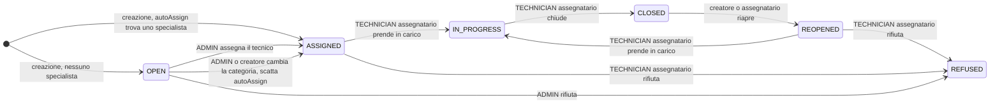

# Autorizzazione (CASL)

Cosa può fare ogni ruolo, su ogni risorsa, e dove stanno le regole.

## Come è organizzata

```
lib/casl/defineAbility.ts          ← composing point: unisce tutti i domini
        │
        ├── abilities/<dominio>/rules.ts    ← le regole: qui si aggiunge un permesso
        ├── abilities/<dominio>/guards.ts   ← assertCan* (server) / hook can* (UI)
        │
        └── rendering
                ├── accessibleBy(ability, "read")   ← filtro Prisma nelle liste
                ├── assertCan*(ability, ...)        ← controllo nelle mutation
                └── ability.can(...)                ← hook useXxxPermissions()
```

- **Un solo set di regole** per frontend e backend: la stessa ability decide cosa
  mostrare nella UI e cosa consentire lato server, quindi non possono divergere.
- **`rules.ts`** è l'unico posto dove si aggiunge una regola, **`guards.ts`** la
  applica.
- Le regole condizionali valutano la **risorsa**, non il payload della richiesta.

> CASL risponde a «**può** fare X su *questa* risorsa?». Se la domanda è
> «**l'operazione è valida?**» (transizione di stato, formato dati, coerenza dei
> campi) è business rule e sta nel resolver o nello schema Zod.

## Ruoli

| Ruolo | In pratica |
| --- | --- |
| `EMPLOYEE` | apre ticket, gestisce i propri |
| `TECHNICIAN` | lavora sui ticket assegnati, ha specializzazioni |
| `ADMIN` | gestisce i ticket del **proprio dipartimento** |
| `SYSTEM_ADMIN` | trasversale: legge tutto, amministra ruoli e catalogo |

Nessuna ereditarietà: ogni dominio dichiara cosa ottiene ogni ruolo.

## Ticket

### Ciclo di vita

La creazione non parte da uno stato neutro: il ticket nasce già `ASSIGNED` se
`autoAssign` trova un tecnico specialista nella categoria, altrimenti nasce `OPEN` e
resta da assegnare. Le transizioni ammesse stanno in `ALLOWED_STATUS_TRANSITIONS`, non
in CASL, perché sono una macchina a stati e non una questione di permessi.



### Cosa può fare ogni ruolo, per stato

| Stato | `EMPLOYEE` | `TECHNICIAN` | `ADMIN` | `SYSTEM_ADMIN` |
| --- | --- | --- | --- | --- |
| `OPEN` | legge, modifica i campi base, elimina | come employee | legge tutto il reparto, assegna il tecnico, cambia stato, priorità e categoria | solo i ticket che ha creato |
| `ASSIGNED` | come `OPEN`, non lo stato | prende in carico o rifiuta, scadenza, riassegnazione | come `OPEN`, e rifiuta | solo i ticket che ha creato |
| `REOPENED` | — | prende in carico o rifiuta | — | riapre i propri |
| `IN_PROGRESS` | — | chiude | — | solo i ticket che ha creato |
| `CLOSED` | riapre i propri | riapre quelli assegnati a sé | — | riapre i propri |
| `REFUSED` | — | — | — | — |

`REFUSED` è uno stato finale e in nessuno stato diverso da `OPEN` e `ASSIGNED` il
ticket è eliminabile. Nessun ruolo ha un vantaggio sulla **lettura**, che non
dipende dallo stato ma solo dalla relazione con il ticket.

### Riepilogo per azione

| Azione | `EMPLOYEE` | `TECHNICIAN` | `ADMIN` | `SYSTEM_ADMIN` |
| --- | --- | --- | --- | --- |
| Lettura | i propri | i propri + assegnati a sé | tutto il reparto + i propri creati | tutti |
| Creazione | sì, campi base | sì, campi base | sì, campi base | sì, campi base |
| Modifica | i propri se aperti o assegnati; riapre i chiusi | come employee + stato, scadenza, riassegnazione dei assegnati a sé | come employee + assegnatario, stato, priorità, categoria nel proprio reparto | solo i ticket che ha creato lui |
| Cancellazione | i propri se aperti o assegnati | come employee | come employee | come employee |

- **Creazione**: nessun ruolo sceglie l'assegnatario, lo calcola il backend
  (`autoAssign`).
- **`ADMIN` e la categoria**: può cambiarla quando il ticket è aperto, **oppure in
  qualsiasi stato se è lui l'ultimo ad averlo aggiornato**, per esempio subito
  dopo averlo assegnato.
- **`SYSTEM_ADMIN`**: la trasversalità si ferma alla lettura. Sulla modifica valgono
  le regole del creatore, quindi tocca solo i propri ticket.

### Disallineamenti noti

Non sono stati possibili in teoria, ma transizioni che il codice non rende
raggiungibili o che lasciano un buco. Sono qui finché non vengono sistemati.

- **`ADMIN` non può riaprire.** Il registry gli assegna `CLOSED → REOPENED`, ma la
  regola CASL gli nega lo stato su un ticket `CLOSED`. La transizione non si può
  mai usare.
- **Cambio categoria su un ticket in lavorazione.** L'`ADMIN` può cambiare la
  categoria in qualsiasi stato se è l'ultimo ad aver aggiornato il ticket, ma
  `update.ts` forza `status = "ASSIGNED"`: un ticket `IN_PROGRESS` torna
  silenziosamente ad assegnato. Il controllo delle transizioni gira solo quando lo
  stato arriva dalla richiesta, quindi qui non parte.
- **`REOPENED` non è eliminabile.** La cancellazione è consentita in `OPEN` e
  `ASSIGNED` soltanto, quindi un ticket riaperto sfugge a chi lo aveva creato anche
  se nella pratica è ancora lavoro da fare.


## Messaggi (TicketMessage)

| Azione | `EMPLOYEE` | `TECHNICIAN` | `ADMIN` | `SYSTEM_ADMIN` |
| --- | --- | --- | --- | --- |
| Scrittura | ticket creati, se non chiusi o rifiutati | anche ticket assegnati a sé, aperti o in lavorazione | ticket del proprio reparto, se non chiusi o rifiutati | nessuna scrittura trasversale |
| Cancellazione | solo i propri | solo i propri | solo i propri | solo i propri |

## Utenti e specializzazioni

| Azione | `EMPLOYEE` | `TECHNICIAN` | `ADMIN` | `SYSTEM_ADMIN` |
| --- | --- | --- | --- | --- |
| Lettura | — | solo se stesso | il proprio reparto | tutti |
| Cambio ruolo | — | — | — | sì, tranne il proprio e altri `SYSTEM_ADMIN` |
| Specializzazioni | — | — | dei tecnici del proprio reparto | — |

## Categorie e accessi

| Azione | `EMPLOYEE` / `TECHNICIAN` | `ADMIN` | `SYSTEM_ADMIN` |
| --- | --- | --- | --- |
| Lettura operativa (dashboard, form, filtri) | categorie attive con grant valido per reparto e ruolo | idem | categorie attive con almeno un grant attivo |
| Gestione catalogo | — | proprio reparto, incluse le disabilitate | tutto il catalogo e la matrice |

La matrice di accesso è l'unica fonte di visibilità operativa: nessuno vede il
catalogo per dipartimento, nemmeno l'admin del reparto. La trasversalità del system
admin vale per **gestire** il catalogo, non per **usarlo**.

## Notifiche (campanella e subscription)

| Azione | `EMPLOYEE` | `TECHNICIAN` | `ADMIN` | `SYSTEM_ADMIN` |
| --- | --- | --- | --- | --- |
| Lettura e cancellazione | le proprie | le proprie | le proprie | le proprie |
| Subscription | — | — | sì, anche su ticket non propri | sì, su qualsiasi ticket |

## Statistiche

| Azione | `EMPLOYEE` | `TECHNICIAN` | `ADMIN` | `SYSTEM_ADMIN` |
| --- | --- | --- | --- | --- |
| Statistiche | — | — | proprio reparto | qualsiasi reparto + globale |

## History

| Azione | `EMPLOYEE` | `TECHNICIAN` | `ADMIN` | `SYSTEM_ADMIN` |
| --- | --- | --- | --- | --- |
| Lettura | ticket creati | creati + assegnati a sé | tutto il proprio reparto | tutto |

## Viste della lista ticket

| Scope | `EMPLOYEE` | `TECHNICIAN` | `ADMIN` | `SYSTEM_ADMIN` |
| --- | --- | --- | --- | --- |
| `MINE` | ✓ | ✓ | ✓ | ✓ |
| `ASSIGNED_TO_ME` | | ✓ | | |
| `DEPARTMENT` | | | ✓ | |
| `ALL` | | | | ✓ |

## Note

- **Lock da ultimo aggiornamento admin.** Un ticket toccato da un admin resta
  bloccato per gli altri ruoli finché l'admin non interviene di nuovo: serve a
  lasciare al tecnico assegnatario lo spazio per prendere in carico il lavoro.
  Unica eccezione, lo **stato**, e solo per l'assegnatario, altrimenti un altro
  tecnico potrebbe muovere un ticket non suo. Il blocco colpisce anche il
  `SYSTEM_ADMIN`. Appena il tecnico interviene il lock scompare da solo.
- **Due regole che non sono permessi.** `browseAssignees` e la `assignedToId` in
  creazione servono **solo a decidere cosa mostrare nella UI**: l'elenco dei tecnici
  del reparto e il suggerimento di auto-assegnazione. Non autorizzano scritture.
- **Le notifiche non sono scoped per proprietà.** Un admin può attivarle su un ticket
  non suo e la campanella resta leggibile anche se il ticket non lo è più. Il
  controllo vero è `assertCanReadTicket` sulla pagina, che risponde `FORBIDDEN`.
- **Non sta in CASL** perché non è una domanda "chi può": transizioni di stato
  ammesse, regola della `dueDate`, verifica che l'assegnatario abbia la
  specializzazione della categoria, validazione dello specific value, assegnazione
  automatica, calcolo delle scadenze.
- **Per aggiungere un permesso**: il subject in `types.ts` (e in `AppSubjects` se è
  nuovo), la `can` in `rules.ts` dentro il blocco del ruolo, poi l'applicazione:
  `accessibleBy` per le liste, `assertCan*` per le mutation, hook `can*` per la UI.
  Se la regola è condizionale, verifica che l'adapter del subject popoli i campi
  richiesti, altrimenti il check fallisce in silenzio.
- **Gli hook nascondono i pulsanti, non proteggono.** La protezione sta nel resolver:
  una regola senza `assertCan*` o `accessibleBy` corrispondente non è un permesso.
  Lo scope di gestione prende il `department` dalla sessione, mai dagli argomenti.
