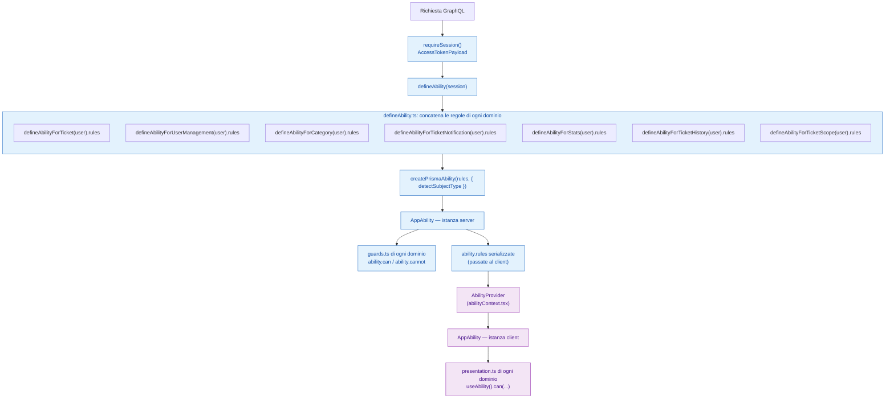

# Architettura CASL — come i domini vengono uniti

## In breve

Ogni dominio (`ticket`, `category`, `ticket-scope`, ...) definisce le proprie
regole CASL in isolamento, in `lib/casl/abilities/<dominio>/`, e le documenta
nel proprio `docs/<dominio>/casl.md`. Questo file non spiega *le regole* di
nessun dominio: spiega solo *come tutti i domini vengono composti* in
un'unica ability applicativa (`lib/casl/defineAbility.ts`) e come quella
ability arriva fino al frontend (`lib/casl/abilityContext.tsx`). Se cerchi il
pattern di un dominio specifico — come tagga un subject parziale, come separa
stato da permesso, come combina più filtri in una query — è nel `casl.md` di
quel dominio, non qui.

## Diagramma



## Composizione lato server (`defineAbility.ts`)

```ts
const rules = [
  ...defineAbilityForTicket(user).rules,
  ...defineAbilityForUserManagement(user).rules,
  ...defineAbilityForCategory(user).rules,
  ...defineAbilityForTicketNotification(user).rules,
  ...defineAbilityForStats(user).rules,
  ...defineAbilityForTicketHistory(user).rules,
  ...defineAbilityForTicketScope(user).rules,
] as unknown as RawRuleOf<AppAbility>[];

return createPrismaAbility<AppAbility>(rules, { detectSubjectType });
```

Ogni dominio produce il proprio array di regole in isolamento (chiamando la
propria `defineAbilityFor<Dominio>(user)`), e qui vengono semplicemente
concatenate in un unico array prima di costruire l'ability finale.

`AppActions` e `AppSubjects` sono l'unione dei tipi di ogni dominio:

```ts
export type AppActions =
  | TicketActions
  | UserManagementActions
  | CategoryActions
  | TicketNotificationActions
  | StatsActions
  | TicketHistoryActions
  | TicketScopeActions;

export type AppSubjects = Subjects<{
  Ticket: TicketForAbility;
  TicketMessage: TicketMessageForAbility;
  User: UserForAbility;
  TicketCategory: CategoryForAbility;
  TicketCategoryAccess: TicketCategoryAccessForAbility;
  TicketNotification: TicketNotificationForAbility;
  TicketStats: StatsForAbility;
  TicketHistory: TicketHistoryForAbility;
  TicketScope: TicketScopeForAbility;
}>;
```

### Perché la concatenazione è sicura

La concatenazione preserva esattamente il comportamento delle singole
ability perché **i domini non condividono nomi di subject**: `Ticket`,
`TicketMessage`, `User`, `TicketCategory`, `TicketCategoryAccess`,
`TicketNotification`, `TicketStats`, `TicketHistory`, `TicketScope` sono tutti
nomi distinti. Le regole di un dominio non possono quindi mai influenzare i
check su un subject di un altro dominio — non c'è bisogno di isolare gli
array a runtime, basta che i nomi non collidano.

### `detectSubjectType`

```ts
detectSubjectType: (subject) => {
  if (subject && typeof subject === "object" && "__caslSubjectType__" in subject) {
    return subject.__caslSubjectType__;
  }
  return subject?.__typename ?? subject?.constructor?.name;
}
```

Prova, in ordine:

1. Il tag `__caslSubjectType__`, impostato da `subject(...)` di
   `@casl/ability` — usato dai guard lato server e da molti check lato
   client con subject parziali.
2. `__typename`, per oggetti GraphQL grezzi non passati per `subject()`.
3. Il nome del costruttore, come ultima risorsa.

Serve un'unica funzione condivisa da tutti i domini proprio perché l'ability
finale è unica: qualunque dominio abbia scritto il subject, il rilevamento
del tipo deve funzionare allo stesso modo. I check con subject **stringa**
(regole incondizionate come `ability.can("manage", "TicketCategory")`, o
`accessibleBy(ability, "read").ofType("Ticket")`) non passano da qui: il
subject è già il nome, non un oggetto da ispezionare.

## Composizione lato client (`abilityContext.tsx`)

```tsx
export function AbilityProvider({ initialRules, children }) {
  const ability = useMemo(
    () =>
      createPrismaAbility(initialRules, {
        detectSubjectType: (object) => object.__typename,
      }),
    [initialRules]
  );

  return <AbilityContext.Provider value={ability}>{children}</AbilityContext.Provider>;
}

export function useAbility(): AppAbility {
  const ctx = useContext(AbilityContext);
  if (!ctx) throw new Error("useAbility must be used within AbilityProvider");
  return ctx;
}
```

Il client non richiama `defineAbility(session)`: riceve `initialRules`, cioè
le regole già calcolate lato server per quella sessione, serializzate, e
ricostruisce l'ability nel browser con lo stesso `createPrismaAbility` usato
sul server. Il `detectSubjectType` qui è più semplice — solo `__typename` —
perché nel frontend i subject arrivano quasi sempre da oggetti GraphQL, non
da `subject(...)` lato server.

`useAbility()` è l'unico punto di accesso all'ability nel client: ogni hook
di ogni `presentation.ts` di ogni dominio lo richiama, invece di ricostruirsi
la propria istanza.

## Aggiungere un dominio nuovo alla composizione

Toccando solo questo file (oltre a scrivere il dominio stesso):

1. Import di `defineAbilityFor<NuovoDominio>` e delle sue regole in cima al
   file.
2. Import dei suoi tipi (`<NuovoDominio>Actions`, `<Subject>ForAbility`) per
   estendere `AppActions` e `AppSubjects`.
3. Aggiungere `...defineAbilityFor<NuovoDominio>(user).rules` all'array in
   `defineAbility()`.

Non serve toccare `detectSubjectType` né `abilityContext.tsx`: sono generici
e non conoscono i domini uno per uno. L'unico vincolo è che i nomi dei
subject del nuovo dominio non collidano con quelli già registrati in
`AppSubjects`.