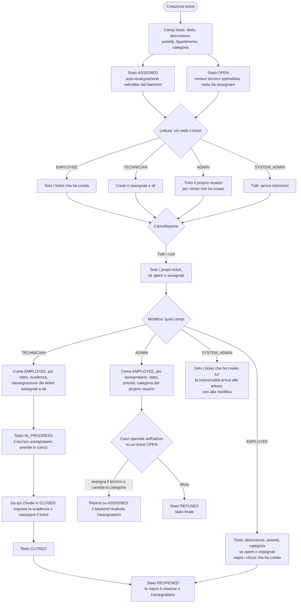

# Ciclo di vita del ticket

## In breve

Un ticket parte da una richiesta di un utente e cambia stato man mano che il lavoro
avanza: qualcuno lo prende in carico, lo porta avanti, e alla fine lo chiude o lo
rifiuta. Chi può fare cosa a ogni passo dipende da due cose soltanto: se sei il
creatore o l'assegnatario del ticket, e in quale reparto lavori. Ognuno vede i
propri ticket, il tecnico anche quelli che ha in carico, l'amministratore di reparto
tutti quelli del suo reparto, l'amministratore di sistema tutti quanti. Se nessuno è
specializzato nella categoria scelta, il ticket nasce aperto e senza assegnatario, e
aspetta che qualcuno lo prenda.

## Flusso

## Azioni per ruolo

| Azione | `EMPLOYEE` | `TECHNICIAN` | `ADMIN` | `SYSTEM_ADMIN` |
| --- | --- | --- | --- | --- |
| Lettura | i propri | i propri e quelli assegnati a sé | tutto il reparto e i propri creati | tutti |
| Creazione | sì, campi base | sì, campi base | sì, campi base | sì, campi base |
| Modifica | i propri, quando sono aperti o assegnati | come `EMPLOYEE`, più stato, scadenza e riassegnazione dei ticket assegnati a sé | come `EMPLOYEE`, più assegnatario, stato, priorità e categoria del proprio reparto | solo i ticket che ha creato lui |
| Cancellazione | i propri, quando sono aperti o assegnati | come `EMPLOYEE` | come `EMPLOYEE` | come `EMPLOYEE` |

Nella creazione nessun ruolo sceglie l'assegnatario: lo calcola il backend in base
alla categoria e al carico di lavoro dei tecnici. Chi può cambiare la categoria, cioè
il creatore del ticket e l'amministratore del reparto, fa scattare quell'assegnazione
anche senza scegliere nessun tecnico, e il ticket passa ad `ASSIGNED`.

L'amministratore di reparto può cambiare la categoria quando il ticket è aperto, e
inoltre in qualsiasi stato se è lui l'ultimo ad averlo aggiornato, per esempio subito
dopo averlo assegnato. Sulla modifica l'amministratore di sistema non ha poteri
trasversali: valgono le regole del creatore, quindi tocca solo i ticket che ha creato
lui.

## Stati per ruolo

La creazione non parte da uno stato neutro: il ticket nasce già `ASSIGNED` se
l'assegnazione automatica trova un tecnico specialista nella categoria, altrimenti
nasce `OPEN` e resta da assegnare. Le transizioni ammesse stanno in
`ALLOWED_STATUS_TRANSITIONS` e non in CASL, perché sono una macchina a stati e non una
domanda di permessi.

| Stato | `EMPLOYEE` | `TECHNICIAN` | `ADMIN` | `SYSTEM_ADMIN` |
| --- | --- | --- | --- | --- |
| `OPEN` | legge, modifica i campi base ed elimina | come `EMPLOYEE` | legge tutto il reparto, assegna il tecnico, cambia stato, priorità e categoria | solo i ticket che ha creato |
| `ASSIGNED` | come `OPEN`, ma non lo stato | prende in carico o rifiuta, imposta la scadenza, riassegna | come `OPEN`, e rifiuta | solo i ticket che ha creato |
| `REOPENED` | — | prende in carico o rifiuta | — | riapre i propri |
| `IN_PROGRESS` | — | chiude | — | solo i ticket che ha creato |
| `CLOSED` | riapre i propri | riapre quelli assegnati a sé | — | riapre i propri |
| `REFUSED` | — | — | — | — |

`REFUSED` è l'unico stato davvero finale: da lì non esce nessuna transizione, e il
ticket non è nemmeno eliminabile, perché l'eliminazione è consentita solo quando è
aperto o assegnato. `CLOSED` invece non è finale, perché il creatore o l'assegnatario
lo possono riaprire in `REOPENED`. Nessun ruolo ha un vantaggio sulla **lettura**,
che non dipende dallo stato ma solo dalla relazione con il ticket.

## Casi particolari

**Il blocco dopo l'ultimo aggiornamento dell'admin.** Un ticket su cui ha lavorato
un amministratore di reparto resta bloccato per gli altri ruoli finché l'amministratore
non interviene di nuovo: serve a lasciare al tecnico assegnatario lo spazio per
prendere in carico il lavoro senza che nessun altro lo modifichi a freddo. L'unica
eccezione è lo stato, e solo per l'assegnatario, altrimenti un altro tecnico potrebbe
muovere un ticket che non è suo. Il blocco colpisce anche l'amministratore di
sistema. Appena il tecnico interviene il blocco scompare da solo.

**Due regole che sembrano permessi ma non lo sono.** `browseAssignees` e la
`assignedToId` in creazione servono solo a decidere cosa mostrare nella interfaccia:
l'elenco dei tecnici del reparto e il suggerimento di auto-assegnazione. Non
autorizzano nessuna scrittura, perché in creazione l'assegnatario non è un campo che
l'utente possa scegliere.

## Disallineamenti noti

Non sono transizioni possibili in teoria, ma percorsi che il codice non rende
raggiungibili o che lasciano un buco. Sono qui finché non vengono sistemati.

- **L'amministratore di reparto non può riaprire.** Il registro gli assegna
  `CLOSED → REOPENED`, ma la regola CASL gli nega lo stato su un ticket `CLOSED`. La
  transizione non si può mai usare.
- **Cambio categoria su un ticket in lavorazione.** L'amministratore di reparto può
  cambiare la categoria in qualsiasi stato se è l'ultimo ad aver aggiornato il ticket,
  ma l'update forza lo stato ad `ASSIGNED`: un ticket `IN_PROGRESS` torna
  silenziosamente ad assegnato. Il controllo delle transizioni gira solo quando lo
  stato arriva dalla richiesta, quindi in questo caso non parte.
- **Un ticket riaperto non è eliminabile.** L'eliminazione è consentita solo quando il
  ticket è aperto o assegnato, quindi un ticket `REOPENED` sfugge a chi lo aveva
  creato anche se nella pratica è ancora lavoro da fare.
